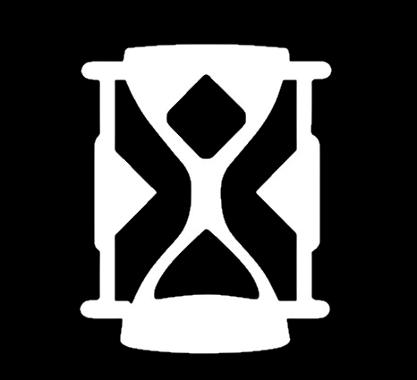

# FocusX 
**Stay focused. Get things done.**

🔗 [Live Demo](https://focusx.up.railway.app/)

FocusX is a full-stack productivity web app designed to help users stay focused by gamifying tasks.  
It pairs focused work sessions with progress tracking and personalized rewards, making productivity feel more intentional and fun.

## 🛠 Tech Stack

### ♦️ Frontend
🔗 [GitHub - Frontend](https://github.com/angelinakumanova/focusx-frontend)

- **React** with **TypeScript** - building a scalable, type-safe user interface
- **Vite** - lightning-fast build tool for a smooth developer experience

### ♦️ Backend
🔗 [GitHub - Backend](https://github.com/angelinakumanova/focusx-backend)

- Java 21 + Spring Boot
- JWT Authentication
- Microservice Architecture
- Apache Kafka - for asynchronous communication
- MongoDB - NoSQL database
- Redis - caching to reduce database load

### ♦️ Deployment & DevOps
- **Docker** - containerization for consistent environments and deployment
- **Railway** - hosting platform for backend and frontend

## 🚀 Features

- **Customizable Pomodoro timer** ⏳ with adjustable work and break intervals to boost productivity.  
- **Goal tracking system** 🎯 to monitor progress on your personal or professional objectives.  
- **Reward system** 🎁 where users set and earn personalized rewards for achieving milestones.  
- **Secure authentication** 🔐 using JWT for safe access and data privacy.  
- **Microservices architecture** with Apache Kafka enabling real-time communication between services.  
- **Responsive and fast UI** built with React and TypeScript for smooth user experience.

## 🏗️ Architecture Overview

FocusX follows a **microservices architecture**, where each backend service is responsible for a specific domain, communicating asynchronously via **Apache Kafka** for scalability and reliability.

### 🔸 Backend
- Multiple Spring Boot microservices written in Java 21.
- MongoDB is used as the primary database for storing user data, goals, and sessions.
- Kafka handles real-time messaging between services, enabling event-driven updates.

### 🔸 Frontend
- A React + TypeScript single-page application built with Vite.
- Connects to backend microservices through REST APIs.
- Uses JWT tokens for secure authentication and authorization.

### 🔸 Deployment
- All services are containerized with Docker for consistent environments.
- Hosted on Railway, providing seamless deployment and scaling.

## 🙏 Thank You!

Thank you for checking out FocusX!  
I hope this project inspires you to boost your productivity and achieve your goals.  

If you have any feedback or questions, feel free to reach out!

**Happy focusing! 🚀**
